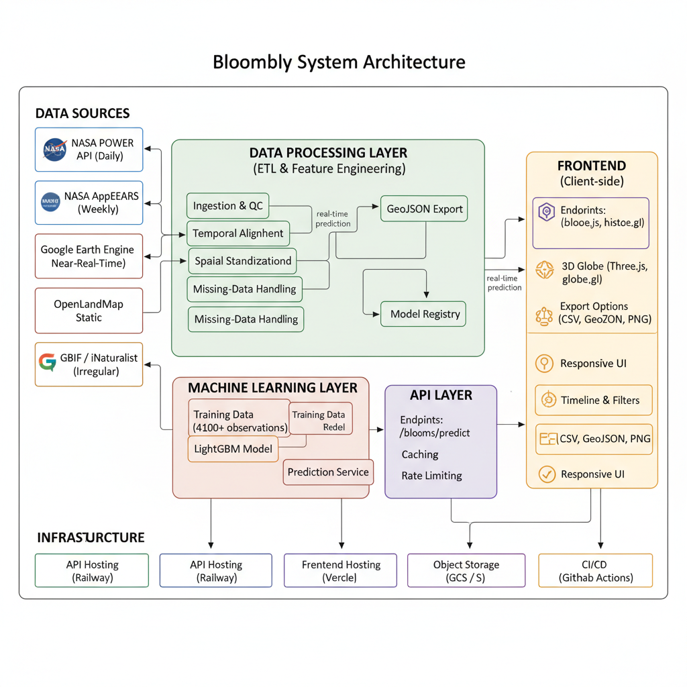

# Bloombly

[](https://www.python.org/)
[](https://developer.mozilla.org/en-US/docs/Web/JavaScript)
[](https://flask.palletsprojects.com/)
[](https://threejs.org/)
[](https://pandas.pydata.org/)
[](https://numpy.org/)
[](https://earthengine.google.com/)
[](https://scikit-learn.org/)
[](https://www.spaceappschallenge.org/)

A machine learning platform that detects and forecasts global plant blooming using Earth observation data. Bloombly converts satellite and environmental data into interactive 3D visualizations and API endpoints for research and operational use.

[](https://bloomly.earth)s [](https://youtu.be/On70ydW8hGE)

---

## Problem statement

Plant phenology (for example, flowering) is a sensitive indicator of climate and ecosystem change. Knowing when and where plants bloom matters for agriculture, biodiversity, public health, and climate research. Satellite data can provide that information at scale, but raw datasets are large and hard to use. Bloombly aims to transform remote sensing data into clear, actionable outputs: detection of current blooms, forecasts of near-term blooms, and visual tools to explore trends.

## Solution overview

Bloombly combines three main capabilities:

1. Global bloom detection from vegetation indices and environmental data.
2. Machine learning forecasts that output a confidence score for bloom events.
3. An interactive 3D globe UI for exploration, filtering, and exporting results.

The system serves predictions and historical data through a REST API and a client that renders blooms on a 3D globe.

## How it works

### Data acquisition

Primary data sources:

* NASA POWER API: meteorological variables (temperature, precipitation, humidity)
* NASA AppEEARS: vegetation indices (NDVI, EVI, EVI2) and land surface products
* Google Earth Engine: satellite imagery and large-scale geospatial processing
* OpenLandMap: soil properties (texture, moisture, temperature)
* GBIF / iNaturalist: citizen science observations for ground truth

### Data processing pipeline

Main steps:

1. Feature extraction: compute 44 ecological variables used by the model.
2. Quality control: cloud masking and removal of sensor anomalies.
3. Temporal alignment: resample and align different time series.
4. Spatial standardization: reproject to WGS84 and normalize resolutions.
5. Missing-data handling: spatial and temporal interpolation.
6. GeoJSON export: convert processed outputs to web-ready formats.

### Prediction model

Model: LightGBM gradient boosting classifier.

* Training set: 4,100+ verified bloom observations.
* Validation strategy: time-series cross-validation to avoid data leakage.
* Output: probability that a given location is in bloom (confidence score).

Conceptual flow:

```
Input features (44) -> LightGBM model -> Bloom / Not Bloom -> Probability
```

### Visualization and delivery

* REST API serves historical and forecasted bloom data.
* Frontend (vanilla JS + Three.js + globe.gl) renders data on a 3D globe.
* UI includes timeline controls, filters (species, region, confidence), and export options (CSV, GeoJSON, PNG).

## System architecture



Instructions to create the system architecture diagram:

1. Recommended tools: diagrams.net (draw.io), Lucidchart, Mermaid for Markdown, or Figma for editable SVG.
2. Components to include:

   * Data sources (NASA POWER, AppEEARS, GEE, OpenLandMap, GBIF/iNaturalist)
   * Data processing layer (ETL, cleaning, feature engineering)
   * Machine learning layer (training, model registry, prediction service)
   * API layer (endpoints such as `/api/blooms/historical`, `/api/blooms/predict`, `/api/species`)
   * Frontend (Three.js, globe.gl, timeline and filters)
   * Infrastructure (hosting, storage, CDN, CI/CD)
3. Visual suggestions:

   * Use layered sections (Data → Processing → ML → API → Frontend).
   * Add arrows for data flow and annotate update frequency (daily, weekly, near-real-time).
   * Group related components and mark externally hosted services.
4. Export recommendations: save diagram as `docs/architecture.png` or `docs/architecture.svg` and add it to the repository.

## Backend and frontend components (summary)

Backend:

* REST API for queries and predictions
* Model server for online inference
* ETL pipelines and scheduled jobs for data ingestion
* Caching for hot endpoints and rate limiting

Frontend:

* 3D globe renderer using Three.js / globe.gl
* Timeline controls, filters, and search
* Data export and image capture features
* Responsive layout and client-side caching

## Key features

* ML-driven bloom prediction with confidence scores
* Global coverage across biomes and latitudes
* Historical analysis and near real-time monitoring
* Multi-species support and advanced filters
* API access and data export in standard formats

## Use cases

Agriculture and production: irrigation scheduling, fertilizer timing, and pollinator planning.
Conservation: monitor phenology shifts, invasive species spread, and habitat change.
Policy and planning: inform public health responses, land-use planning, and climate adaptation.
Research and education: time-series analysis, model validation, and teaching tools.

## Technology stack

### Backend

| Technology              | Purpose                                     |
| ----------------------- | ------------------------------------------- |
| Python 3.9+             | Core logic and data processing              |
| Flask / FastAPI         | REST API and prediction endpoints           |
| LightGBM                | Prediction model                            |
| Scikit-learn            | Model utilities and evaluation              |
| Pandas / NumPy          | Data manipulation and numerical ops         |
| GeoPandas               | Geospatial processing                       |
| Google Earth Engine API | Satellite access and large-scale processing |

### Frontend

| Technology           | Purpose                     |
| -------------------- | --------------------------- |
| JavaScript (vanilla) | Client-side logic           |
| Three.js / globe.gl  | 3D visualization            |
| HTML5 / CSS3         | UI structure and styles     |
| Chart.js             | Charts for analytics panels |

### Infrastructure

| Component         | Platform       |
| ----------------- | -------------- |
| API hosting       | Railway        |
| Frontend hosting  | Vercel         |
| Container runtime | Docker         |
| Object storage    | GCS / S3       |
| CDN               | Cloudflare     |
| CI/CD             | GitHub Actions |

## Data sources

* NASA POWER API: meteorological variables (resolution ~0.5°, coverage 1981–present, daily updates)
* NASA AppEEARS: vegetation indices and land surface products (MODIS, VIIRS; 250 m–1 km)
* Google Earth Engine: multi-spectral imagery and scalable processing
* OpenLandMap: soil property layers (250 m resolution)
* GBIF / iNaturalist: ground-truth observations for training and validation

## NASA Space Apps Challenge

Challenge summary:

The Space Apps prompt asks teams to use NASA Earth observations to create a dynamic visual tool that detects or displays plant blooming events worldwide. The goal is to help monitoring, predicting, or managing vegetation by making satellite data accessible and actionable.

Project Summary:

Bloombly detects and visualizes global plant blooming patterns using NASA Earth observation data. The application integrates satellite products (NDVI, EVI, EVI2, soil metrics, and meteorological variables) to identify bloom events and their shifts over time. A LightGBM model analyzes features such as NDVI, soil moisture, precipitation, and temperature to predict blooms. Predictions and historical records are served via a FastAPI backend to a vanilla JavaScript frontend that renders results on a globe with filters and a timeline. The project aims to provide actionable information for farmers, researchers, and policymakers to improve resource management and detect ecosystem changes.

## Third-party licenses

* Three.js: MIT
* Globe.gl: MIT
* LightGBM: MIT
* NASA data: Public domain (U.S. Government)

## Acknowledgments

* NASA Earth Science Division
* Google Earth Engine team
* NASA Space Apps Challenge organizers
* Citizen scientists on iNaturalist and GBIF
* Open-source projects used in the implementation
